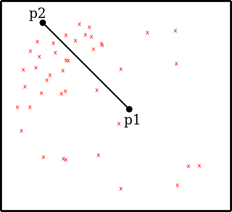

## The Problem

In 2D we have two points (p1 and p2) which define a line segment. Additionally, there exists experimental data which can be anywhere on the domain. Find the data point which is closest to the line segment.

## Starting Point

Here is some sample data to get you started:

<pre>import numpy as np

p1 = np.array([0.0, 0.0])
p2 = np.array([1.0, 1.0])
data = np.array([][0.3, 0.6], [0.25, 0.5], [1.0, 0.75]])
</pre>

If you want to generate some random points you can use `np.random.random`. Here we generate 50x 2D points.

<pre>import numpy as np

data = np.random.random((50,2))

</pre>

## Outline

1.  Create a git repository on your machine and using for committing the code you write.
2.  Write tests in test_*.py file.
3.  Write a code (please don't get fustrated, it doesn't have to work) in a *.py file.
4.  Run nose.
5.  Create a github repository, add it as a remote to your local repo and push your local repo.
6.  Pick a partner.
7.  Fork your partner's Github repo and clone it onto your machine.
8.  Write tests to break their code.
